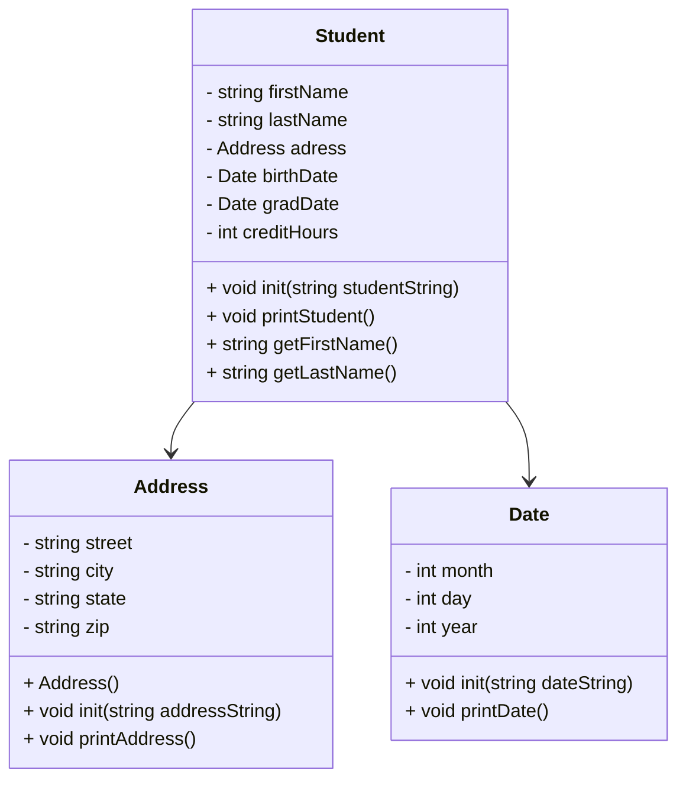

# heapStudents
10/7/2026

## UML



Address::Address
```
Constructor
street = ""
city = ""
state = ""
zip = ""
```

void Address::init(std::string addressString) 
```
// read Address from students.csv file
// addressString is a string in format "street,city,state,zip"
// send addressString to stringstream and parse into address fields

stringstream ss(addressString)
getline(street, comma)
getline(city, comma)
getline(state, comma)
getline(zip, comma)
```

void Address::printAddress()
```
/* output example:
123 W Main St
Muncie IN, 47303
*/

cout street, endl
cout city, state, zip
```

Date::Date()
```
Constructor
month = 0;
day = 0;
year = 0;
```

void Date::init(std::string dateString)
```
// Read Date from students.csv file
// dateString is a string in the format "month/day/year"
// Send the dateString to a stringstream and parse it into date field
// Need to use temp variable to hold the value of each field before converting

stringstream ss(dateString)
getline(ss, temp, '/')
stringstring(temp) >> month // repeat for day and year
```

void Date::printDate()
```
// Establish list of months in string form Jan, Feb, March as "months" list
string months[] = { list of months }
if (month >= 1 && month <= 12)
  cout << months[month - 1] << " " << day << ", " << year << std::endl

// using month - 1 as index so that the month has to be between 1 and 12

// This converts the month number into string format for dates, then prints
```

testAddress()
```
Provided by lab
```

testDate()
```
Provided by lab
```

int main()
```
Relatively simple, just testing to make sure functions work properly FOR NOW
cout "Hello" endl
testAddress()
testDate()
```


